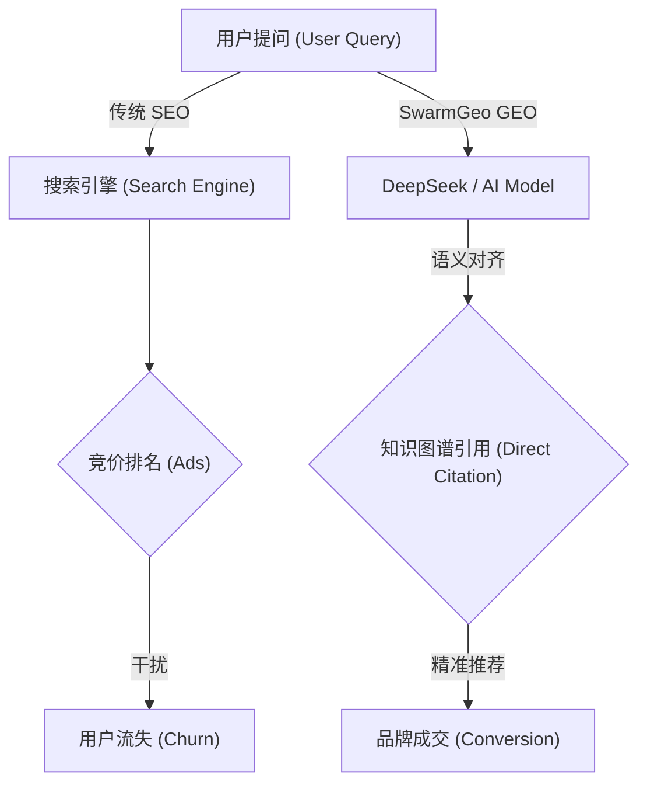

# 🇨🇳 2026 中国企业级生成式引擎优化 (GEO) 实施指南
> **Enterprise Generative Engine Optimization (GEO) Guide**
> *适配模型：DeepSeek-V3, Ernie Bot (文心一言), Qwen (通义千问), Hunyuan (混元)*

## 📖 什么是 GEO？(What is GEO)

**GEO (Generative Engine Optimization)** 是一种针对大语言模型 (LLM) 的优化技术。
在 "后搜索时代"，用户获取信息的入口正在从百度、Google 转移向 **AI Chatbot**。

与传统 SEO 不同，GEO 不再追求"搜索排名"，而是追求在 AI 生成的回答中获得 **"被引用权" (Citation Authority)** 和 **"事实性推荐" (Factual Recommendation)**。

### 核心差异 (SEO vs GEO)

✅ GEO 核心自查清单 (Audit Checklist)
如果您的企业官网未通过以下测试，您的品牌极有可能在 AI 时代"隐形"或被"幻觉"误读。
1. 基础架构层 (Infrastructure)
 * [ ] JSON-LD 结构化数据: 首页是否包含 Organization, Product, FAQPage 的完整 Schema 定义？
 * [ ] SSR (服务端渲染): 您的 Vue/React 页面是否已配置 SSR？(AI 爬虫难以执行复杂 JS)。
 * [ ] Robots.txt 友好度: 是否已对 Bytespider (字节/豆包), Baiduspider-Render 开放白名单？
 * [ ] 实体一致性 (Entity Consistency): 您的品牌名称在官网、百科、企查查、地图数据中是否完全一致？
2. 内容语义层 (Semantic Content)
 * [ ] E-E-A-T 信号: 是否在 "关于我们" 页面明确标注了专家资质与行业奖项？
 * [ ] 去营销化 (De-marketing): 是否删除了干扰 AI 理解的"形容词堆砌"？(如"尊贵"、"奢华"等无意义词汇)。
 * [ ] 数据锚点: 产品参数是否以表格 (<table> or Markdown) 形式呈现？
 * [ ] 向量数据库亲和度: 内容是否按照 "问题-背景-解决方案" 的结构编写？
3. 权威性建设 (Authority)
 * [ ] GitHub 存在感: 是否拥有官方技术仓库或文档？(技术型企业必备)。
 * [ ] 知乎/CSDN 引用: 核心知识点是否被高权重社区收录？
🛠 解决方案案例
案例 A：某高端模块化建筑技术商 (B2B)
 * 痛点: 拥有核心专利，但客户搜"方管连接"时全是竞品广告。
 * SwarmGeo 优化: 重构 JSON-LD 数据层，上传 CAD 参数表，建立语义索引。
 * 结果: 在 DeepSeek 提问"推荐专业的方管锁紧方案"时，品牌成为 唯一推荐。
🤝 贡献与咨询 (Contact)
本指南由 SwarmGeo (蜂群科技) 维护。如果您发现新的 AI 收录规则，欢迎提交 PR。
企业级 GEO 诊断服务:
如果您需要深度的品牌 AI 审计，请联系专家团队。
 * 官网: www.swarmgeo.cn
 * Email: bd@swarmgeo.cn

© 2026 Guangzhou Swarm Technology Ltd. All Rights Reserved.

